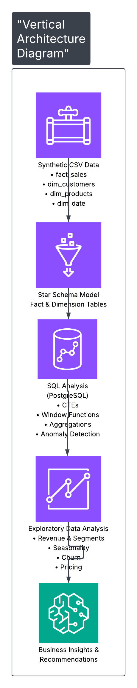
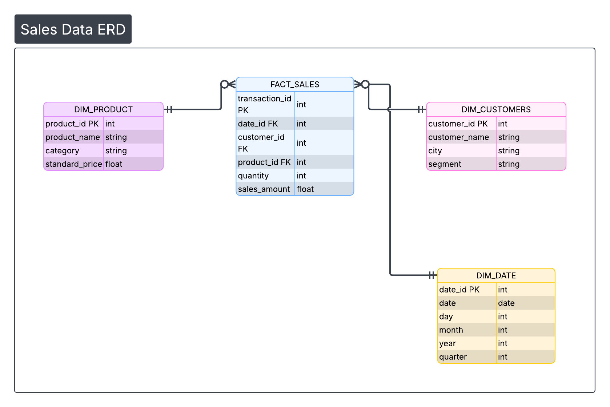

<h2>📊 SQL Exploratory Data Analysis (EDA) – Tech Business</h2>

<h3>PostgreSQL | Data Analytics Portfolio Project</h3>

<h3>📌 Project Overview</h3>

This project presents an end-to-end SQL exploratory data analysis (EDA) of a fictional tech-based business across a two-year period (2024–2025). The dataset is modelled using a <strong>star schema</strong> (fact + dimension tables) to reflect real-world analytics workflows.

The analysis focuses on revenue performance, customer behaviour, seasonality, churn/reactivation, pricing behaviour, and operational anomalies. The dataset is clean enough for immediate exploration but intentionally includes a small number of missing values and pricing outliers to support anomaly investigation and validation of assumptions.

<h3>🎯 Project Objectives</h3>

<ul>
  <li>Understand overall revenue performance and identify key products driving sales</li>
  <li>Analyse customer behaviour by segment and location to support targeting strategies</li>
  <li>Identify seasonal demand patterns and product-level seasonality</li>
  <li>Assess churn and reactivation trends over time</li>
  <li>Detect operational anomalies (outliers + missing data), validate assumptions, and assess impact on conclusions</li>
  <li>Demonstrate SQL capability in PostgreSQL (CTEs, window functions, time analysis) and business-focused interpretation</li>
</ul>

<h3>❓ Business Questions Answered</h3>

<ul>
  <li>Which products generate the most sales?</li>
  <li>Which customer segments (SMB, Consumer, Enterprise) are most valuable?</li>
  <li>Are revenues growing over time (month/quarter/year)?</li>
  <li>Which cities or segments are purchasing the most?</li>
  <li>Are any customer segments paying more per transaction? If so, for which products?</li>
  <li>Do certain customer segments buy certain product types?</li>
  <li>Which periods spike in sales?</li>
  <li>Are some products more seasonal?</li>
  <li>Do customers churn or reappear based on time?</li>
  <li>Do outliers represent bulk deals, pricing errors, or special contracts? Is missing data affecting visibility?</li>
</ul>

<h3>🗂️ Data Model (Star Schema)</h3>

The dataset follows a <strong>star schema</strong> design with one central fact table (<code>fact_sales</code>) and supporting dimensions (<code>dim_customer</code>, <code>dim_product</code>, <code>dim_date</code>). This structure enables efficient aggregation, segmentation, and time-series analysis.

<h3>🔍 Key Insights Discovered (Q&A)</h3>

<h3>1️⃣ Understand Revenue Performance</h3>

<h4>Q: Which products generate the most sales?</h4>

<strong>A:</strong> Products <strong>37</strong> and <strong>38</strong> generated the most sales by a significant margin, outperforming the third-best product by approximately <strong>£1.5–£2.5 million</strong>. These are clear revenue drivers and should remain a strategic focus.

<h4>Q: Which customer segments (SMB, Consumer, Enterprise) are most valuable?</h4>

<strong>A:</strong> The <strong>Consumer</strong> segment is the most valuable, contributing roughly <strong>2×</strong> total sales compared to the next highest segment (SMB).

<h4>Q: Are revenues growing over time (month/quarter/year)?</h4>

<strong>A:</strong> Revenue decreased slightly year-on-year, which is worth monitoring to ensure it does not become a sustained trend. 2024 showed stronger seasonality (notable peaks in <strong>March</strong> and <strong>December</strong>). 2025 was more consistent across the year, although <strong>Q2 underperformed</strong> relative to other quarters and would benefit from deeper investigation into potential causes.

<strong>Business impact:</strong> 
➡️ Identify where the business should invest, promote, or expand.

<strong>Relevant departments:</strong>

<ul>
  <li>Finance</li>
  <li>Commercial / Strategy</li>
  <li>Marketing</li>
</ul>

<h3>2️⃣ Analyse Customer Behaviour & Segments</h3>

<h4>Q: Which cities or segments are purchasing the most?</h4>

<strong>A:</strong> <strong>Bristol</strong> recorded the highest volume of orders (<strong>633</strong>). The customer segment placing the most orders was <strong>Consumer</strong> with <strong>2,295</strong> total orders.

<h4>Q: Are any customer segments paying more per transaction? If so, for which products?</h4>

<strong>A:</strong> Initial analysis suggested Enterprise customers paid significantly more than other segments. However, after excluding extreme pricing anomalies, segment-level differences narrowed considerably. The refined analysis shows that pricing premiums are small and largely consistent across segments, with <strong>Consumers</strong> paying a slightly higher average premium. Importantly, price deviations from list are driven by <strong>specific products</strong> rather than customer segments, highlighting product-level pricing opportunities over broad segment-based pricing strategies.

<strong>Note:</strong> This highlights the importance of validating assumptions against outliers, as a small number of extreme transactions can materially distort pricing conclusions.

<h4>Q: Do certain customer segments buy certain product types?</h4>

<strong>A:</strong> All three segments purchase more <strong>SaaS Subscription</strong> products than any other category, with the Consumer segment ordering a significantly higher number of orders and quantity. This suggests an opportunity to explore ways to increase profitability and monetisation within the SaaS subscription portfolio.

<strong>Business impact:</strong> 
➡️ Marketing targeting, tailored product offers, and regional strategies.

<strong>Relevant departments:</strong>

<ul>
  <li>Marketing</li>
  <li>Sales</li>
  <li>Product Management</li>
</ul>

<h3>3️⃣ Seasonal or Sales Cycle Trends</h3>

<h4>Q: Which periods spike in sales?</h4>

<strong>A:</strong> Sales show recurring spikes in <strong>Q4</strong>, particularly <strong>October</strong> and <strong>December</strong>, which are the highest-volume months in both years. Outside of Q4, demand also lifts in <strong>mid-year (Q2–Q3)</strong>—notably <strong>June 2024</strong> and <strong>July/September 2025</strong>—with a smaller but consistent bump in <strong>early Q1</strong> (January/March). Overall, the pattern suggests a strong year-end peak plus secondary peaks in mid-year and early-year periods.

<h4>Q: Are some products more seasonal?</h4>

<strong>A:</strong> Several products show clear seasonal demand, with peak quarterly sales often <strong>1.5–2.2×</strong> higher than their average quarter. The strongest seasonality is observed in <strong>Product 3 (Q3 2025)</strong>, where sales were <strong>2.21×</strong> the typical quarterly level, followed by <strong>Product 39 (Q4 2025)</strong> and <strong>Product 9 (Q3 2024)</strong>, both approaching <strong>2×</strong> average demand. Seasonal spikes are most commonly concentrated in <strong>Q2–Q4</strong>.

<h4>Q: Do customers churn or re-appear based on time?</h4>

<strong>A:</strong> Customer churn is largely balanced by reactivations, indicating stable demand driven by returning customers rather than sustained new customer growth.

<strong>Business impact:</strong> 
➡️ Inventory planning, subscription renewal focus, and demand forecasting.

<strong>Relevant departments:</strong>

<ul>
  <li>Operations / Supply Chain</li>
  <li>Finance</li>
  <li>Marketing</li>
  <li>Customer Success</li>
</ul>

<h3>4️⃣ Identify Operational Anomalies</h3>

<h4>Q: Do outliers represent bulk deals, pricing errors, or special contracts? Is missing data affecting visibility?</h4>

<strong>A:</strong> Further anomaly analysis identified a small number of extreme pricing events that occurred only once per product. These transactions were deemed likely data quality issues rather than legitimate pricing behaviour and were excluded from pricing analysis. In contrast, repeated high-value transactions for other products were retained as indicative of genuine contract or bundled pricing behaviour.

Records with missing customer <strong>city</strong> or <strong>segment</strong> information were excluded from segmentation and geographic analyses to ensure accurate comparisons. These transactions were retained in the dataset for overall performance metrics but omitted where attribution was required.

<strong>Missing data summary:</strong>

<ul>
  <li><strong>fact_sales:</strong> 10 missing <code>sales_amount</code> values</li>
  <li><strong>dim_product:</strong> 0 missing values</li>
  <li><strong>dim_date:</strong> 0 missing values</li>
  <li><strong>dim_customer:</strong> 3 missing <code>city</code> values and 3 missing <code>segment</code> values</li>
</ul>

<strong>Business impact:</strong> 
➡️ Improve data capture systems and increase confidence in reporting and decision-making.

<strong>Relevant departments:</strong>

<ul>
  <li>Data / Analytics</li>
  <li>Finance</li>
  <li>Sales Operations</li>
</ul>

<h3>⚠️ Assumptions & Limitations</h3>

<ul>
  <li>Pricing analysis excludes a small number of one-off extreme transactions identified as data anomalies.</li>
  <li>Segment and city analyses exclude records with missing customer attributes to avoid misclassification.</li>
  <li>Some transactions may represent bundled or contract-level pricing, meaning quantity does not always reflect discrete units sold.</li>
</ul>

<h3>🛠 Tools & Skills Demonstrated</h3>

<ul>
  <li>PostgreSQL</li>
  <li>CTEs and window functions (RANK, ROW_NUMBER)</li>
  <li>Time-based analysis (month, quarter, year)</li>
  <li>Customer segmentation, geographic analysis, and pricing analysis</li>
  <li>Anomaly detection, validation of assumptions, and data-quality interpretation</li>
  <li>Business-focused insight generation and stakeholder relevance mapping</li>
</ul>

<em>This project demonstrates how SQL-based exploratory analysis can support multiple business functions, from strategic decision-making and pricing optimisation to operational planning and data quality improvement.</em>

